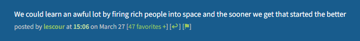

# MetaFilter user scripts

## MeFi Navigator Redux

A slimmer, updated version of the [original Mefi Navigator script](https://userscripts-mirror.org/scripts/show/3330).

- **Navigate users' comments** with up and down arrows, and see their comment count. If this is their only comment, nothing is added to the comment byline.

- **Highlights OP's comments** with a left border (like on AskMe).

- **Highlights your comments** with a "me" indicator.

## MeFi replace quote label

[Install from Greasy Fork (**recommended**, automatic updates)](https://greasyfork.org/en/scripts/531115-mefi-replace-quote-label) | [Install from github](https://raw.githubusercontent.com/klipspringr/mefi-userscripts/main/mefi-replace-quote-label.user.js)

MetaFilter's [built-in MefiQuote functionality](https://metatalk.metafilter.com/26605/Better-MetaFiltering-through-scripting) adds a quote button to each comment.

- Neatens up the comment byline by replacing "quote" with a reply arrow, and moving it to between + and ⚑.

- For a custom label, use your browser's developer tools to set the Local Storage key `mefi-replace-quote-label` to the desired string.

