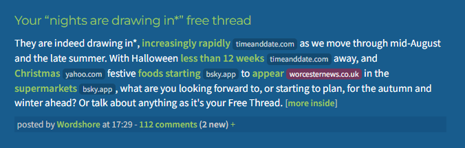

# MetaFilter user scripts

This is a collection of userscripts which improve the MeFi experience. [What is a userscript and how do I install one?](https://greasyfork.org/en/help/installing-user-scripts)

## MeFi Navigator Redux

**[Install](https://raw.githubusercontent.com/klipspringr/mefi-userscripts/main/mefi-navigator-redux.user.js)** &middot; also on [Greasy Fork](https://greasyfork.org/en/scripts/531257-mefi-navigator-redux)

An updated, slimmer version of the [original Mefi Navigator script](https://userscripts-mirror.org/scripts/show/3330).

- **Navigate between a user's comments** with up and down arrows, and see the number of comments they've made in the post. If this is their only comment, nothing is added to the comment byline.

- **Highlights the original poster's comments** with a left border (like AskMe does).

- **Highlights your comments** with a `me` badge.

## MeFi Domain Labels

**[Install](https://raw.githubusercontent.com/klipspringr/mefi-userscripts/main/mefi-domain-labels.user.js)** &middot; also on [Greasy Fork](https://greasyfork.org/en/scripts/545798-mefi-domain-labels)

- **Label domains in post links.** No mystery meat here! 🥩

- **Choose domains to highlight in red.**
  - Tap `Edit highlighted domains` in userscript settings and enter a comma-separated list of domains.
  - They will be highlighted like `worcesternews.co.uk` is, below.

## MeFi replace quote label

**[Install](https://raw.githubusercontent.com/klipspringr/mefi-userscripts/main/mefi-replace-quote-label.user.js)** &middot; also on [Greasy Fork](https://greasyfork.org/en/scripts/531115-mefi-replace-quote-label)

MetaFilter's [built-in MefiQuote functionality](https://metatalk.metafilter.com/26605/Better-MetaFiltering-through-scripting) adds a quote button to each comment.

- This script **neatens up the comment byline** by replacing "quote" with a reply arrow, and moving it to between + and ⚑.

- For a **custom label**, use your browser's developer tools to set the Local Storage key `mefi-replace-quote-label` to the desired string.

## Notes

- I use Chrome on Windows and the Modern Dark theme. I've briefly tested the scripts in other browsers and themes. If something looks skew-whiff, open an issue or [MeMail me](https://www.metafilter.com/user/304523), providing a screenshot if possible.
